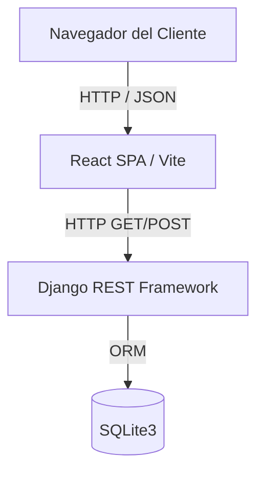
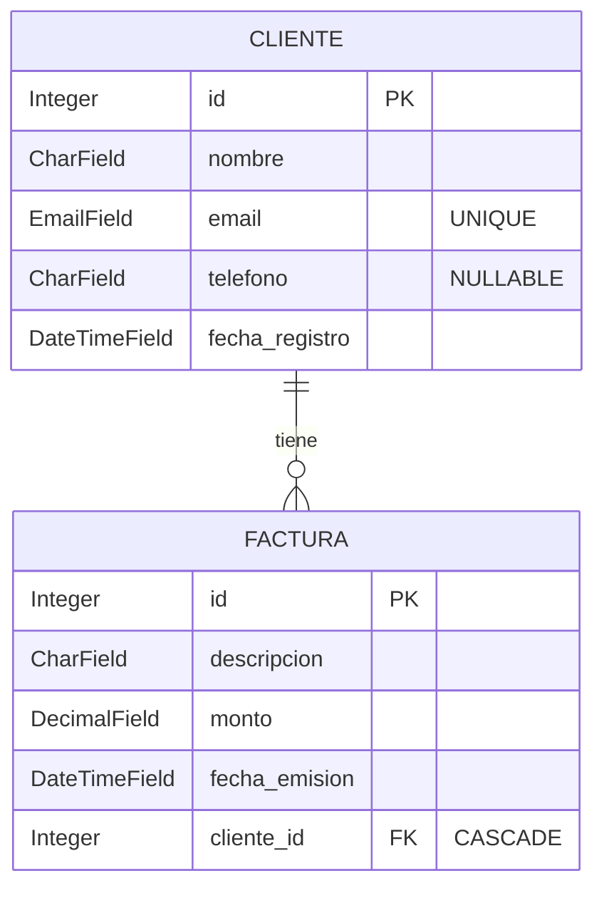
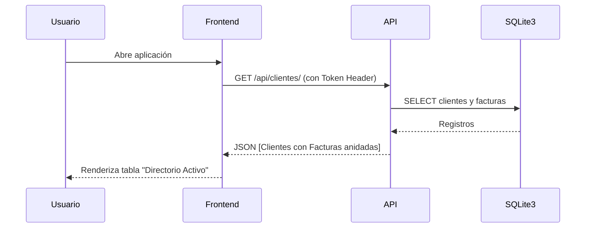

# Documentación Técnica: CRM Enterprise

## 01 — INTRODUCCIÓN

**Nombre del Sistema:** CRM Enterprise (CRM Backend Django)
**Propósito:** Aplicación de Gestión de Relaciones con el Cliente (CRM).
**Problema que resuelve:** Permite el registro de clientes y la emisión, visualización y seguimiento de facturas asociadas a estos.
**Alcance:** 
- Visualización del directorio de clientes y sus facturas asociadas.
- Registro de nuevos clientes.
- Emisión de nuevas facturas asociadas a clientes existentes.
- Exploración de la API a través de documentación interactiva (Swagger).
**Usuarios objetivo:** Usuarios internos de la organización que necesiten registrar movimientos y altas de clientes.
**Límites conocidos del sistema:** 
- No existe un flujo de registro o login de usuarios en el frontend (autenticación estática).
- No permite la edición o eliminación de entidades desde la interfaz web, únicamente su creación y lectura.

---

## 02 — VISIÓN GENERAL DEL SISTEMA

El sistema sigue una arquitectura **Cliente-Servidor** separada y se compone de dos partes principales:
1. **Frontend (React SPA):** Interfaz de usuario para la interacción, lectura y envío de datos.
2. **Backend (API REST en Django):** Procesa las reglas de negocio, valida datos y proporciona persistencia.

El frontend se comunica con el backend consumiendo endpoints HTTP/REST utilizando JSON. El backend procesa las solicitudes, interactúa con la base de datos relacional y devuelve respuestas JSON.



---

## 03 — ARQUITECTURA

**Estilo arquitectónico:** Separación Frontend / Backend API. El backend emplea el patrón MVT (Model-View-Template) de Django, adaptado a MVC usando `ModelViewSets` y `Serializers` para funcionar estrictamente como API REST.

**Capas del Backend:**
- **Routing (`urls.py`):** Mapea URLs a ViewSets utilizando `DefaultRouter`.
- **Controllers (`views.py`):** Implementa la lógica de manejo de requests a través de `ModelViewSet`, que provee operaciones CRUD automáticas.
- **Data Transfer / Serialización (`serializers.py`):** Convierte querysets de modelos a JSON y viceversa. Anida los datos de facturas dentro de los clientes (`factura_set`).
- **Data Access (`models.py`):** Define las entidades y se comunica con SQLite vía ORM.

**Capas del Frontend:**
- **Presentación y Estado (`App.jsx`):** Todo el estado y la interfaz gráfica conviven en un único componente de React que maneja `useState` y peticiones `fetch`.

---

## 04 — ESTRUCTURA DEL PROYECTO

```text
crm-backend-django/
├── crm-backend/                 # Proyecto Django
│   ├── crm_api/                 # Configuración principal del backend
│   │   ├── settings.py          # Configuraciones (CORS, BD, Auth)
│   │   └── urls.py              # Enrutamiento raíz y Swagger
│   ├── clientes/                # Módulo principal de lógica de negocio
│   │   ├── models.py            # Entidades (Cliente, Factura)
│   │   ├── views.py             # ViewSets (Lógica de API)
│   │   ├── serializers.py       # Serializadores DRF
│   │   └── urls.py              # Enrutamiento de la API de clientes
│   ├── db.sqlite3               # Base de datos local
│   └── manage.py                # Script de administración de Django
└── crm-frontend/                # Proyecto React
    ├── package.json             # Dependencias de npm y scripts
    ├── vite.config.js           # [ASUMIDO POR VITE] Configuración de build
    └── src/
        ├── App.jsx              # Lógica y UI del CRM
        ├── index.css            # Estilos globales básicos
        └── main.jsx             # Punto de entrada de React
```

---

## 05 — TECNOLOGÍAS Y DEPENDENCIAS

| Tecnología / Librería | Versión | Uso |
| :--- | :--- | :--- |
| **Python** | 3.x (Asumido) | Lenguaje de Backend |
| **Django** | 4.2.29 | Framework Web de Backend |
| **Django REST Framework** | - | Construcción de API RESTful |
| **django-cors-headers** | - | Middleware para habilitar CORS |
| **drf-spectacular** | - | Generación de documentación OpenAPI/Swagger |
| **SQLite3** | - | Base de datos relacional nativa |
| **React / React DOM** | ^19.2.8 | Librería de UI para Frontend |
| **Vite** | ^8.2.0 | Herramienta de build y servidor de dev Frontend |

*(Nota: Las versiones de Python y librerías de backend se infieren a partir del entorno de ejecución, ya que [NO DETERMINADO EN EL CÓDIGO] no existe archivo `requirements.txt` o similar).*

---

## 06 — MODELO DE DATOS



- **Cliente:** Entidad principal. El atributo `email` impone una restricción de unicidad a nivel de base de datos.
- **Factura:** Dependiente de Cliente. Una factura pertenece a un solo cliente. La clave foránea está configurada con `CASCADE`, por lo que si se elimina un cliente, todas sus facturas asociadas se eliminán de la base de datos automáticamente.

---

## 07 — API

El sistema utiliza *ModelViewSets*, lo que expone automáticamente todos los métodos CRUD para cada entidad. A continuación se listan los utilizados explícitamente en el sistema.

### Clientes

**`GET /api/clientes/`**
- **Descripción:** Obtiene la lista de todos los clientes. Retorna los clientes incluyendo un arreglo anidado de sus facturas (`facturas`).
- **Autenticación:** Requerida (Token).

**`POST /api/clientes/`**
- **Descripción:** Crea un nuevo cliente.
- **Autenticación:** Requerida (Token).
- **Request:** `{ "nombre": "String", "email": "String", "telefono": "String" }`

### Facturas

**`POST /api/facturas/`**
- **Descripción:** Crea una nueva factura asociada a un cliente.
- **Autenticación:** Requerida (Token).
- **Request:** `{ "descripcion": "String", "monto": "Number", "cliente": "Integer (ID)" }`

### Documentación

**`GET /api/docs/`**
- **Descripción:** Interfaz gráfica Swagger UI con la especificación OpenAPI generada por `drf-spectacular`.

---

## 08 — AUTENTICACIÓN Y AUTORIZACIÓN

- **Mecanismo:** El backend está configurado para requerir autenticación en todas las rutas a través del permiso `IsAuthenticated` de DRF. Emplea `TokenAuthentication` y `SessionAuthentication`.
- **Implementación observable:** El frontend realiza las peticiones `fetch` enviando un token estático incrustado en el código fuente (`Token e505dc3c0a4fd9dd7583e2ae53a5611d4eff5156`).
- **[NO IMPLEMENTADO]:** No existe un flujo dinámico de login, generación, expiración, ni refresco de tokens en el frontend. Todo usuario del frontend opera bajo la misma identidad del token hardcodeado.
- **Roles:** No existen roles de usuario o restricciones granulares documentadas en el código.

---

## 09 — LÓGICA DE NEGOCIO

1. **Unicidad de correo electrónico:**
   - *Dónde:* `models.py` (Cliente.email)
   - *Regla:* No se permite registrar dos clientes con el mismo correo.
   - *Resultado:* Excepción de integridad; la API devuelve HTTP 400 Bad Request.

2. **Borrado en Cascada (Integridad Referencial):**
   - *Dónde:* `models.py` (Factura.cliente)
   - *Regla:* Si se elimina un cliente, se eliminan todas sus facturas.

---

## 10 — FLUJOS IMPORTANTES

### Flujo: Visualización del Directorio (Carga Inicial)


---

## 11 — MANEJO DE ERRORES

- **Backend (API):**
  - DRF maneja las excepciones del ORM automáticamente.
  - HTTP 400 (Bad Request): Para errores de validación (ej. email duplicado, tipos de datos inválidos).
  - HTTP 401 (Unauthorized): Si el token es inválido o no se envía.
- **Frontend:**
  - Los errores de red o códigos HTTP no exitosos en las peticiones GET se capturan en un bloque `.catch()` y se muestran en un banner rojo (estado `error`).
  - Para peticiones POST fallidas, el sistema notifica al usuario rudimentariamente a través de un `alert()` de JavaScript genérico.

---

## 12 — CONFIGURACIÓN

- **[NO DETERMINADO EN EL CÓDIGO]:** El sistema no utiliza variables de entorno ni archivos `.env`.
- Todo está configurado de forma fija en `settings.py`:
  - `DEBUG = True` (Peligroso para producción).
  - `SECRET_KEY` en texto plano.
  - `CORS_ALLOWED_ORIGINS = ["http://localhost:5173", "http://127.0.0.1:5173"]`.

---

## 13 — INSTALACIÓN Y DESARROLLO

**Requisitos Previos:** Node.js, Python 3.x.

**Ejecución del Backend:**
```bash
cd crm-backend
# Activar entorno virtual si aplica (ej: venv\Scripts\activate)
# [REQUIERE CONFIRMACIÓN] Instalar dependencias dado que no hay requirements.txt:
pip install django djangorestframework django-cors-headers drf-spectacular
python manage.py migrate
python manage.py runserver
```

**Ejecución del Frontend:**
```bash
cd crm-frontend
npm install
npm run dev
```
Acceder a `http://localhost:5173`.

---

## 14 — TESTING

- **Framework:** `django.test` (observado por los archivos por defecto).
- **Cobertura observable:** 0%.
- **[NO IMPLEMENTADO]:** Aunque existe un archivo `tests.py` en `clientes/`, está vacío (pesa solo 63 bytes, típico de la creación por defecto). El frontend no incluye dependencias de testing (Jest/Vitest) en `package.json`.

---

## 15 — DESPLIEGUE

- **[NO IMPLEMENTADO]:** No existen Dockerfiles, scripts de despliegue, archivos YAML de CI/CD (GitHub Actions), ni configuraciones de producción (ej. Gunicorn/Nginx, PostgreSQL). El sistema está configurado exclusivamente para correr en entorno local (`DEBUG=True`, Base de datos SQLite local).

---

## 16 — MANTENIMIENTO

- **Añadir nuevas funcionalidades (Backend):**
  - Modificar `clientes/models.py`.
  - Crear la migración: `python manage.py makemigrations`.
  - Aplicar la migración: `python manage.py migrate`.
  - Modificar `serializers.py` si hay nuevos campos relacionales.
- **Añadir componentes (Frontend):**
  - Actualmente todo se encuentra centralizado en `App.jsx`. Para escalabilidad futura, se sugiere crear una carpeta `src/components/` y dividir la lógica (ej. `ClientForm`, `InvoiceForm`, `ClientTable`).

---

## 17 — TROUBLESHOOTING

| Problema | Posible Causa | Solución |
| :--- | :--- | :--- |
| **Error de conexión: Error al conectar con la API** (en UI rojo) | CORS bloquea la petición u ocurre un HTTP 401 Unauthorized. | Asegurar que `corsheaders` esté en `INSTALLED_APPS` y que exista un usuario en la BD de Django que posea el token hardcodeado (`e505dc...`). |
| **Alerta: La API rechazó al cliente. Revisa el email.** | El email introducido ya existe en otro cliente de la base de datos. | Usar un email distinto o implementar actualización de clientes existentes. |
| **Alerta: La API rechazó la factura.** | El payload enviado por el frontend tiene tipos de datos erróneos, o la vista de facturas no está enrutada. | Verificar payload en la pestaña *Network* del navegador. |

---

## 18 — DECISIONES ARQUITECTÓNICAS

**ADR-001 — Uso de Django REST Framework ModelViewSets**
- **Contexto:** Se necesitaba proveer un backend CRUD de forma ágil para ser consumido por un frontend SPA.
- **Decisión:** Se utilizaron `ModelViewSet` en `views.py` y `DefaultRouter` en `urls.py`.
- **Consecuencias:** Minimiza severamente el código repetitivo del backend. Se exponen endpoints completos automáticamente, aunque también exponen operaciones (PUT/DELETE) que actualmente el frontend no consume.

**ADR-002 — Componente monolítico en el Frontend**
- **Contexto:** [MOTIVACIÓN ORIGINAL NO DOCUMENTADA]
- **Decisión:** Toda la aplicación frontend (formularios, tabla, estado, llamadas HTTP) está contenida dentro del archivo `App.jsx`.
- **Consecuencias:** Desarrollo inicial más veloz al evitar prop-drilling, pero introduce una alta deuda técnica en mantenibilidad y dificultad de testeo.

---

## 19 — SEGURIDAD

- **Implementado:** 
  - Restricción de orígenes cruzados vía `CORS_ALLOWED_ORIGINS`.
  - Validación de unicidad de email delegada al motor de Base de Datos y controlada por DRF.
- **No Implementado / Vulnerabilidades Observadas:**
  - `SECRET_KEY` está hardcodeado en `settings.py` (riesgo de seguridad grave si se despliega).
  - Un **Token de Autorización** está escrito directamente en el código fuente público (`App.jsx`). Cualquier persona con acceso al código fuente del frontend compromete al servidor.
  - La API de Swagger y Admin están expuestas sin protección adicional explícita o configuraciones de throttling (Rate limiting no observable).

---

## 20 — LIMITACIONES Y DEUDA TÉCNICA

- **Deuda Técnica Evidente:** Archivo `App.jsx` gigante (16KB, +300 líneas de código). 
  - *Impacto:* Dificulta refactorizaciones y testeo de componentes aislados. 
  - *Mejora:* Extraer Hooks personalizados (`useClientes`) y componentes puros (`FormularioCliente`, `TablaClientes`).
- **Falta de gestión de dependencias en backend:** No hay `requirements.txt`.
  - *Impacto:* Impide garantizar construcciones reproducibles; los desarrolladores nuevos deben adivinar dependencias.
- **Ausencia de Paginación:** 
  - *Evidencia:* `GET /api/clientes/` retorna el dataset completo. 
  - *Impacto:* Problemas severos de rendimiento cuando la base de datos crezca considerablemente.

---

## 21 — CHANGELOG

- *(No documentado en el sistema)*

---

## 22 — GLOSARIO

- **CRM:** Customer Relationship Management. Sistema de gestión de relaciones con clientes.
- **DRF:** Django REST Framework. Herramienta utilizada para construir la API web.
- **SPA:** Single Page Application. Patrón utilizado en React donde toda la interacción ocurre sin recargar la página.

---

## 23 — ÍNDICE DE REFERENCIA RÁPIDA

| Necesito... | Consultar... |
| :--- | :--- |
| Entender el sistema | 02 — VISIÓN GENERAL y 03 — ARQUITECTURA |
| Configurar el proyecto | 13 — INSTALACIÓN Y DESARROLLO |
| Conocer la BD | 06 — MODELO DE DATOS |
| Consumir la API | 07 — API |
| Desplegar | 15 — DESPLIEGUE (Advertencias) |
| Resolver errores | 17 — TROUBLESHOOTING |
| Entender decisiones | 18 — DECISIONES ARQUITECTÓNICAS |

---

## 24 — AUDITORÍA DE DOCUMENTACIÓN

- **Información Confirmada:** El flujo de datos entre `App.jsx` y los ViewSets de Django, el modelo de datos (campos y relaciones foráneas), y las rutas configuradas de la API y de Swagger. El token de autorización duro en el frontend.
- **Información Inferida:** El propósito de uso es interno dado que no hay registro/login dinámico. La carencia de tests se infirió del tamaño diminuto (por defecto de inicialización) de `tests.py` y la falta de frameworks en `package.json`.
- **Información Faltante:** Archivo para gestión estricta de paquetes de Python (`requirements.txt`, `Pipfile`, `pyproject.toml`). No hay evidencia de archivos para despliegue.
- **Documentación que debería actualizarse:** Si el sistema evoluciona a tener login real, el diagrama de flujo y la sección de autenticación deberán ser reescritos.
- **Decisiones cuyo motivo no puede determinarse:** Por qué se agruparon las UI y toda la lógica de estado en el mismo archivo `App.jsx`, y por qué el token está quemado en el cliente sin login formal.
